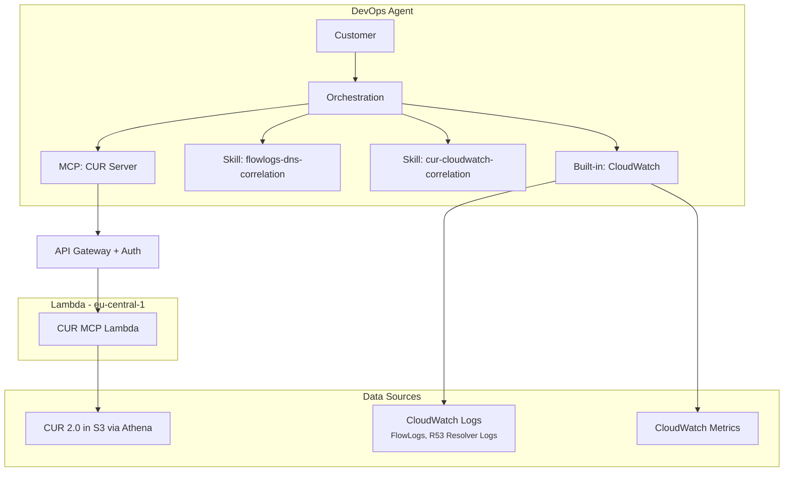
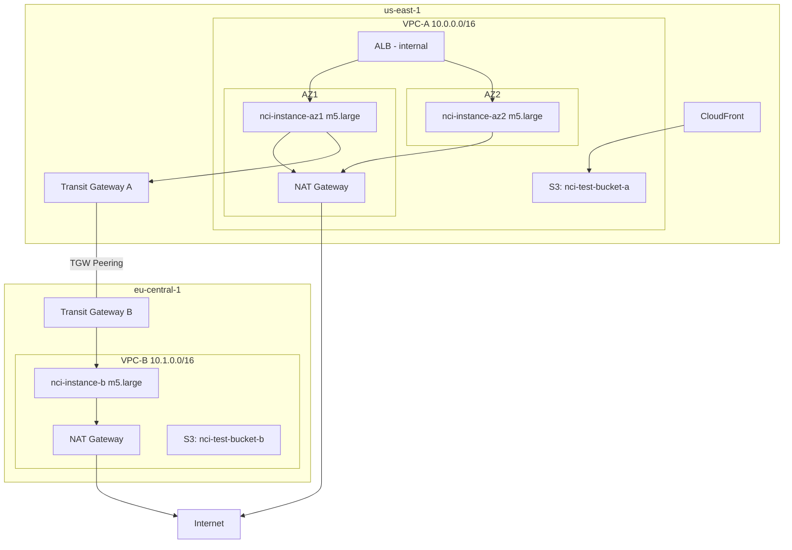

# Design Document: AWS Networking Cost Investigation Engine (POC)

## Overview

An internal investigation engine that helps customers troubleshoot cost-related issues in AWS networking services. The system uses AWS DevOps Agent (Frontier agent) as the orchestrator and customer interface. The agent handles flow log analysis and CloudWatch metrics natively, guided by custom Skills. A CUR MCP server provides cost data from Athena that the agent cannot access directly (Athena queries are blocked as mutative operations in DevOps Agent).

## Architecture

## Data Sources

### Accessed by DevOps Agent natively (built-in CloudWatch integration)

| Data Source | Log Group / Location | What it provides |
|---|---|---|
| VPC Flow Logs | /nci/vpc-flow-logs/vpc-a (us-east-1), /nci/vpc-flow-logs/vpc-b (eu-central-1) | Traffic patterns, bytes by destination, cross-AZ/cross-region volumes. Custom format with all v5 fields including pkt-src-aws-service, pkt-dst-aws-service, az-id, traffic-path, flow-direction |
| R53 Resolver Query Logs | /nci/r53-resolver/vpc-a (us-east-1), /nci/r53-resolver/vpc-b (eu-central-1) | IP-to-FQDN mapping for enriching flow log destination IPs |
| CloudWatch Metrics | Standard NAT GW, TGW, ELB metrics | BytesProcessed, ErrorPortAllocation, PacketsDropCount, ActiveConnections, TGW data processed |
| CloudWatch Logs (future) | ALB/NLB access logs, WAF logs, CloudTrail (if sent to CW Logs) | Request-level analysis, error patterns, API call history |

### Accessed via CUR MCP Server (agent cannot query Athena directly)

| Data Source | Location | What it provides |
|---|---|---|
| CUR 2.0 (Data Exports) | S3: <your-cur-bucket>, Athena: nci_cur.cur_data in eu-central-1 | Cost breakdown by service, resource, region, AZ, UsageType, Operation, from/to locations. Includes effective cost (unblended + reservation + savings plan) |

## DevOps Agent Skills

### Skill 1: flowlogs-dns-correlation
Teaches the agent correct methodology for analyzing VPC Flow Logs with R53 DNS Resolver log correlation. Key rules:
- Never use pkt-dst-aws-service to distinguish regions (shows "S3" for all regions)
- Always correlate DNS-resolved IPs with flow log dstaddr for regional attribution
- Rank by bytes transferred, not DNS query count
- Calculate both directions for NAT Gateway cost (ingress + egress)
- Ask for log group paths, don't assume standard naming

### Skill 2: cur-cloudwatch-correlation
Teaches the agent how to correlate CUR cost data with CloudWatch metrics and flow logs for networking cost investigation.

## CUR MCP Server

### Deployment
- Lambda function: nci-cur-mcp (eu-central-1)
- API Gateway: HttpApi with Lambda authorizer (Bearer token)
- Endpoint: <your-api-gateway-url>/prod/mcp
- Uses awslabs.mcp_lambda_handler for MCP Streamable HTTP transport
- Auto-repairs Athena partitions hourly (handles new billing periods)

### Tools (6 total)

| Tool | Purpose |
|---|---|
| getNetworkingCostBreakdown | Total networking cost by service, region, AZ with top spending resources |
| getResourceCostDetail | Full CUR breakdown for a specific resource — all dimensions including UsageType, Operation, from/to regions, effective cost |
| detectCostAnomalies | Compare current vs baseline period, flag resources with >20% cost increase |
| getTopNetworkingSpenders | Top N resources by networking cost |
| getCostTrend | Hourly, daily, or weekly cost trend for networking services |
| getCURDataRange | Exact time range covered by available CUR data |

### Key Design Decisions for CUR Queries
- Uses CUR 2.0 column names (product_region_code, not product_region)
- getResourceCostDetail returns ALL CUR dimensions (not aggregated) — usage_type, operation, line_item_type, description, product_family, from/to locations and regions, AZ
- Uses effective cost: unblended + reservation + savings plan (not just unblended)
- Filters by line_item_line_item_type IN ('DiscountedUsage', 'SavingsPlanCoveredUsage', 'Usage')
- Resource lookup uses LIKE '%resource_id%' to match full ARN format
- COALESCE handles null reservation/savings plan costs (Athena returns empty strings)

## Investigation Process

### Cost Investigation Order
1. **CUR Analysis** (via MCP server) → identify which networking services cost the most, detect anomalies, get resource-level detail with UsageType/Operation breakdown
2. **Flow Log Deep Dive** (agent native + flowlogs-dns-correlation skill) → for top cost resources, analyze traffic patterns with DNS enrichment to understand where traffic goes
3. **CloudWatch Metrics** (agent native) → verify with throughput/connection data (BytesProcessed trends, connection counts)
4. **Correlate & Recommend** (agent reasoning + cur-cloudwatch-correlation skill) → connect cost data with traffic patterns to produce actionable recommendations

## Customer Intake Questions

1. Which AWS account(s) are affected?
2. What time range should we investigate? (and a baseline period to compare against?)
3. Which networking services are you most concerned about? (NAT Gateway, VPC Endpoints, VPN, Inter-AZ, Cross-Region, Transit Gateway)
4. Which regions and VPCs are in scope?
5. What is your expected monthly networking budget?
6. Have there been any recent infrastructure changes?
7. Are there specific resources you want to focus on?

## Analysis Output

An investigation report should contain:
1. **Executive Summary** — what was investigated, what was found, total potential savings
2. **Findings** — prioritized by severity, each with evidence from CUR + flow logs + metrics
3. **Recommendations** — what to do, estimated savings, implementation effort, step-by-step instructions
4. **Data Sources Consulted** — which sources were analyzed and any that were unavailable

## Test Environment Architecture

Logging: VPC Flow Logs (all v5 fields) + R53 Resolver query logging on both VPCs. CUR 2.0 Data Export enabled. No S3 Gateway Endpoint in VPC-A (intentional — forces S3 traffic through NAT).

## Error Handling

| Scenario | Response |
|---|---|
| CUR data not available in Athena | MCP server returns error, suggest enabling CUR |
| VPC Flow Logs not enabled | Agent continues with CUR-only analysis, recommends enabling flow logs |
| R53 Resolver logs not enabled | Agent returns flow log results with raw IPs, recommends enabling resolver logging |
| Athena query timeout | MCP server retries with narrower time range |
| New billing period (new month) | MCP server auto-repairs partitions hourly |
| Insufficient IAM permissions | MCP server returns which API calls failed and what permissions are needed |

## Future Phases

### Phase 2: Production Investigation
- Reachability Analyzer MCP server for connectivity troubleshooting
- getRejectFlows tool for REJECT flow analysis
- Production intake questions and investigation flow

### Phase 3: Agentic Orchestrator
- If DevOps Agent orchestration proves inconsistent, add orchestrator tools to MCP server
- runCostInvestigation tool that runs the full pipeline deterministically

### Phase 4: Additional Data Sources
- ALB/NLB access logs, WAF logs, Transit Gateway Flow Logs
- AWS Config for historical configuration changes
- AWS Pricing API for dynamic per-GB rates

### Phase 5: Proactive & Automated
- CUDOS dashboard integration
- Cost Explorer anomaly detection auto-trigger
- AWS Budgets alarm triggers
- On-demand flow log enablement (enable on specific ENI during investigation, disable after)

### Phase 6: Own Agent
- Bedrock Agent with full control over model, prompts, and reasoning
- If DevOps Agent limitations become blocking
