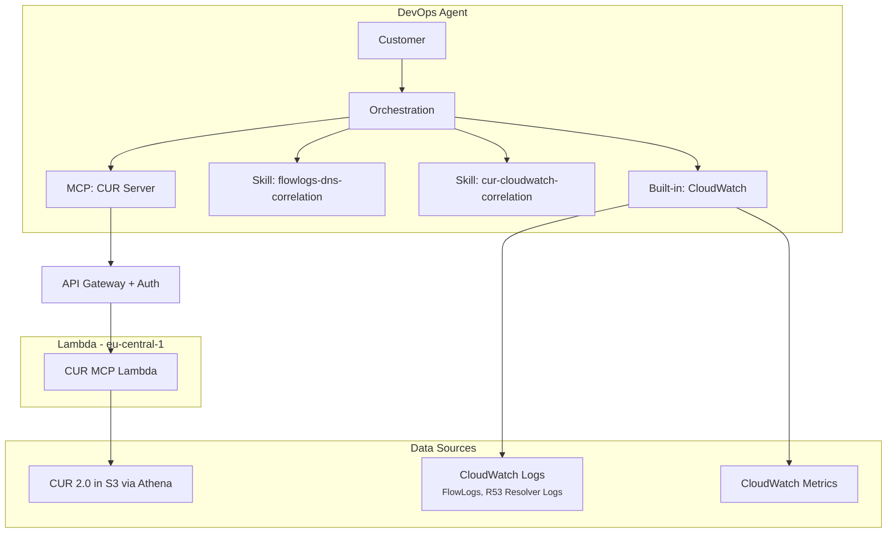
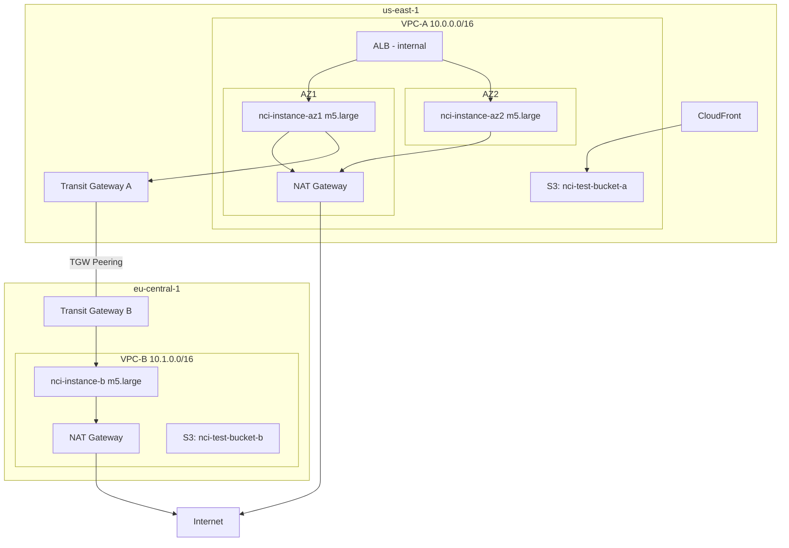

# AWS Networking Cost Investigation Engine (POC)

An investigation engine that helps customers troubleshoot cost-related issues in AWS networking services. The system uses AWS DevOps Agent (Frontier agent) as the orchestrator and customer interface. The agent handles flow log analysis and CloudWatch metrics natively, guided by custom Skills. A CUR MCP server provides cost data from Athena that the agent cannot access directly (Athena queries are blocked as mutative operations in DevOps Agent).

## Architecture



## Data Sources

### Accessed by DevOps Agent natively (built-in CloudWatch integration)

| Data Source | Log Group / Location | What it provides |
|---|---|---|
| VPC Flow Logs | /nci/vpc-flow-logs/vpc-a (us-east-1), /nci/vpc-flow-logs/vpc-b (eu-central-1) | Traffic patterns, bytes by destination, cross-AZ/cross-region volumes. Custom format with all v5 fields including pkt-src-aws-service, pkt-dst-aws-service, az-id, traffic-path, flow-direction |
| R53 Resolver Query Logs | /nci/r53-resolver/vpc-a (us-east-1), /nci/r53-resolver/vpc-b (eu-central-1) | IP-to-FQDN mapping for enriching flow log destination IPs |
| CloudWatch Metrics | Standard NAT GW, TGW, ELB metrics | BytesProcessed, ErrorPortAllocation, PacketsDropCount, ActiveConnections, TGW data processed |

### Accessed via CUR MCP Server (agent cannot query Athena directly)

| Data Source | Location | What it provides |
|---|---|---|
| CUR 2.0 (Data Exports) | S3 bucket + Athena table `nci_cur.cur_data` in eu-central-1 | Cost breakdown by service, resource, region, AZ, UsageType, Operation, from/to locations. Includes effective cost (unblended + reservation + savings plan) |

## DevOps Agent Skills

| Skill | Purpose |
|---|---|
| flowlogs-dns-correlation | Teaches the agent correct methodology for analyzing VPC Flow Logs with R53 DNS Resolver log correlation. Key: never use pkt-dst-aws-service for regional attribution, always correlate DNS-resolved IPs with flow log dstaddr |
| cur-cloudwatch-correlation | Teaches the agent how to correlate CUR cost data with CloudWatch metrics and flow logs for networking cost investigation |

## CUR MCP Server Tools

| Tool | Purpose |
|---|---|
| getNetworkingCostBreakdown | Total networking cost by service, region, AZ with top spending resources |
| getResourceCostDetail | Full CUR breakdown for a specific resource — all dimensions including UsageType, Operation, from/to regions, effective cost |
| detectCostAnomalies | Compare current vs baseline period, flag resources with >20% cost increase |
| getTopNetworkingSpenders | Top N resources by networking cost |
| getCostTrend | Hourly, daily, or weekly cost trend for networking services |
| getCURDataRange | Exact time range covered by available CUR data |

## Investigation Process

1. **CUR Analysis** (via MCP server) → identify which networking services cost the most, detect anomalies, get resource-level detail with UsageType/Operation breakdown
2. **Flow Log Deep Dive** (agent native + flowlogs-dns-correlation skill) → for top cost resources, analyze traffic patterns with DNS enrichment to understand where traffic goes
3. **CloudWatch Metrics** (agent native) → verify with throughput/connection data (BytesProcessed trends, connection counts)
4. **Correlate & Recommend** (agent reasoning + cur-cloudwatch-correlation skill) → connect cost data with traffic patterns to produce actionable recommendations

## Test Environment Architecture



Logging: VPC Flow Logs (all v5 fields) + R53 Resolver query logging on both VPCs. CUR 2.0 Data Export enabled. No S3 Gateway Endpoint in VPC-A (intentional — forces S3 traffic through NAT).

## Project Structure

```
├── mcp-server/                         # Self-contained CUR MCP Server
│   ├── template.yaml                   # SAM template (API GW + Lambda + Auth)
│   ├── src/
│   │   ├── cur_mcp/handler.py          # MCP server Lambda (6 tools)
│   │   └── authorizer/handler.py       # API Gateway Bearer token authorizer
│   └── layers/mcp-deps/
│       └── requirements.txt            # awslabs.mcp_lambda_handler dependency
├── test-environment/                   # CloudFormation for multi-region test lab
│   ├── region-a.yaml                   # us-east-1: VPC, NAT GW, TGW, ALB, CloudFront
│   ├── region-b.yaml                   # eu-central-1: VPC, NAT GW, TGW
│   ├── tgw-peering.yaml               # Transit Gateway peering between regions
│   ├── athena/create_cur_table.sql     # Athena table with all CUR 2.0 columns
│   └── scripts/                        # Traffic generator scripts
├── skills/                             # DevOps Agent Skills
│   ├── flowlogs-dns-correlation/       # Flow log + R53 DNS analysis methodology
│   └── cur-cloudwatch-correlation/     # CUR vs CloudWatch reconciliation
├── specs/                              # Design docs, requirements, task list
│   ├── design.md
│   ├── requirements.md
│   └── tasks.md
└── docs/                               # Architecture diagrams and learnings
    ├── POC-LEARNINGS.md
    └── test-environment-architecture.drawio.png
```

## Prerequisites

- AWS account with admin access
- AWS CLI configured
- SAM CLI installed (`brew install aws-sam-cli`)
- AWS DevOps Agent with MCP server capability enabled

## Deployment Guide

### Step 1: Deploy Test Environment

```bash
# Region A — us-east-1 (VPC, NAT GW, instances, ALB, CloudFront, TGW, flow logs)
aws cloudformation deploy \
  --template-file test-environment/region-a.yaml \
  --stack-name nci-test-region-a \
  --capabilities CAPABILITY_NAMED_IAM \
  --region us-east-1

# Region B — eu-central-1 (VPC, NAT GW, instance, TGW, flow logs)
aws cloudformation deploy \
  --template-file test-environment/region-b.yaml \
  --stack-name nci-test-region-b \
  --capabilities CAPABILITY_NAMED_IAM \
  --region eu-central-1

# TGW Peering (after both stacks are up)
aws ec2 create-transit-gateway-peering-attachment \
  --transit-gateway-id <tgw-a-id> \
  --peer-transit-gateway-id <tgw-b-id> \
  --peer-region eu-central-1 \
  --peer-account-id <your-account-id> \
  --region us-east-1

# Accept peering in eu-central-1
aws ec2 accept-transit-gateway-peering-attachment \
  --transit-gateway-attachment-id <peering-attachment-id> \
  --region eu-central-1
```

### Step 2: Enable CUR 2.0

1. Go to AWS Console → Billing → Data Exports → Create export
2. Select CUR 2.0, Parquet format, hourly granularity
3. Choose an S3 bucket in eu-central-1
4. Wait 24-48 hours for first data delivery

### Step 3: Set up Athena (eu-central-1)

```bash
# Create results bucket
aws s3 mb s3://<your-athena-results-bucket> --region eu-central-1

# Create database and table
aws athena start-query-execution \
  --query-string "CREATE DATABASE IF NOT EXISTS nci_cur" \
  --result-configuration OutputLocation=s3://<your-athena-results-bucket>/ \
  --region eu-central-1

# Create table — update S3 path in the SQL file first, then run:
# test-environment/athena/create_cur_table.sql
```

### Step 4: Deploy CUR MCP Server

```bash
cd mcp-server
sam build
sam deploy --stack-name nci-cur-mcp \
  --region eu-central-1 \
  --capabilities CAPABILITY_IAM \
  --resolve-s3 \
  --parameter-overrides McpAuthToken=<your-bearer-token>
```

### Step 5: Register in DevOps Agent

1. Go to DevOps Agent console → Capability Providers → MCP Server → Register
2. Enter the endpoint URL from Step 4 output
3. Authentication: API Key (Name: `bearer-auth`, Header: `Authorization`, Value: `Bearer <your-bearer-token>`)
4. Add the MCP server to your Agent Space and allowlist all 6 tools

### Step 6: Upload Skills

1. Go to DevOps Agent console → Skills → Add skill → Upload skill
2. Upload `skills/flowlogs-dns-correlation/` and `skills/cur-cloudwatch-correlation/` as zips

### Step 7: Test

Ask the DevOps Agent:
> "Investigate networking costs for account \<your-account-id\> for the last 7 days. Focus on NAT Gateway and Transit Gateway costs."

## Updating MCP Server Code

```bash
# Quick code update (no infra changes)
cd mcp-server/src
zip -r /tmp/cur-mcp-code.zip cur_mcp/ authorizer/
aws lambda update-function-code \
  --function-name nci-cur-mcp \
  --zip-file fileb:///tmp/cur-mcp-code.zip \
  --region eu-central-1

# Full redeploy (infra changes)
cd mcp-server
sam build && sam deploy --stack-name nci-cur-mcp --region eu-central-1 --capabilities CAPABILITY_IAM --resolve-s3
```

## Cleanup

```bash
aws cloudformation delete-stack --stack-name nci-cur-mcp --region eu-central-1
aws ec2 delete-transit-gateway-peering-attachment --transit-gateway-attachment-id <peering-id> --region us-east-1
aws cloudformation delete-stack --stack-name nci-test-region-b --region eu-central-1
aws cloudformation delete-stack --stack-name nci-test-region-a --region us-east-1
```

## Future Phases

- **Phase 2:** Reachability Analyzer MCP server, REJECT flow analysis
- **Phase 3:** Agentic orchestrator tools for deterministic investigation pipelines
- **Phase 4:** ALB/NLB access logs, WAF logs, Transit Gateway Flow Logs, AWS Pricing API
- **Phase 5:** CUDOS dashboard integration, Cost Explorer anomaly auto-triggers
- **Phase 6:** Bedrock Agent with full control over model and reasoning

## Key Learnings

See [`docs/POC-LEARNINGS.md`](docs/POC-LEARNINGS.md) for detailed technical findings, mistakes to avoid, and architecture decisions made during the POC.
